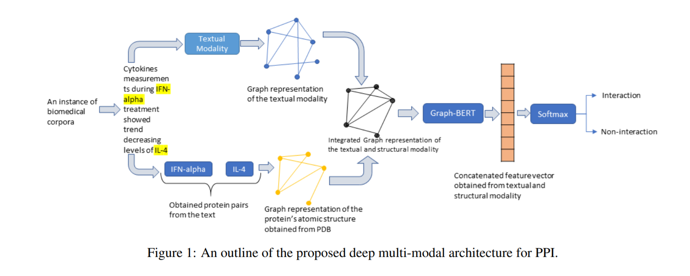

# MagBERT
This is the official implementation of MagBERT (Model Agnostic Graph based BERT for Biomedical Relation Extraction) model described in [Multimodal Graph-based Transformer Framework for Biomedical
Relation Extraction](https://aclanthology.org/2021.findings-acl.328.pdf)

# Introduction
The recent advancement of pre-trained Transformer models has propelled the development of effective text mining models across various
biomedical tasks. In this study, we introduced a novel framework that enables the model to learn multi-omnics biological information about entities (proteins)
with the help of additional multi-modal cues like molecular structure



# Datasets
We use the HPRD Dataset and Bioinfer Datasets. Their corresponding test samples are already included in this repository (In Molecular Structure Folder). Additionally, you can also download the pdb files of protein entities
from HPRD dataset from [here](https://drive.google.com/file/d/115G1vlkL2TOncU2XdhlcVoYGRjHRMeVT/view?usp=sharing) and for Bio-Infer Dataset from [here](https://drive.google.com/file/d/1YOG6CTirzwjC-S8YLXW05hG2qvYLARlx/view?usp=sharing).

# Dependencies
 - Pytorch
 - Sklearn
 - transformers
 - Networkx
 - nltk
 - pypdb
 - Bio
 
# Train Graph-BERT on Bio-Infer / HPDR
In order to replicate the results mentioned in paper, please follow the following steps.
1.  Download the [zip](https://drive.google.com/file/d/1m5NfYV7-GePn5H7mVy9dXdpM25bYba4p/view?usp=sharing) folder and place the two files at ./Graph-Bert/data/ppi.
2.  Do the same for this [zip](https://drive.google.com/file/d/1sE9H8LpNnnbDJz9qAJNOpwbrfU48PGHo/view?usp=sharing) folder and place the two files at ./Graph-Bert/data/biomed.
3. Next use these following commands:<br>
  `cd Graph-Bert`<br>
  `python script_1_preprocess.py`<br> 
  `python script_2_pre_train.py`<br>
  `python script_3_fine_tuning.py`<br> 
  > Details of these python scripts present in Graph-Bert folder
  
# Train on Custom Dataset
The above scripts enable training on the HPRD and Bio-Infer Datasets (Make sure to choose your dataset by un-commenting "ppi" for 
HPRD or "biomed" for Bio-Infer in the three python scripts). 
Although, you can train Graph-BERT on any dataset provided you have all the PDB files extracted. 
Demo notebooks to **extract the protein instances from text, download corresponding pdb files, 
and extracting molecular structure data** from pdb files are present in the **Molecular Structure** Folder 

# References
```
@misc{pingali2021multimodal,
      title={Multimodal Graph-based Transformer Framework for Biomedical Relation Extraction}, 
      author={Sriram Pingali and Shweta Yadav and Pratik Dutta and Sriparna Saha},
      year={2021},
      eprint={2107.00596},
      archivePrefix={arXiv},
      primaryClass={cs.CL}
}
```

# Acknowledgements
Graph-BERT code for this project is based on 
* [Graph-Bert: Only Attention is Needed for Learning Graph Representations](https://github.com/jwzhanggy/Graph-Bert)
